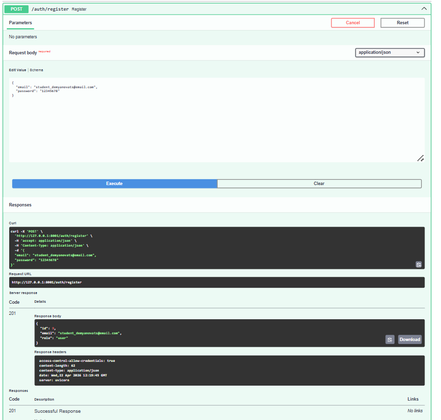
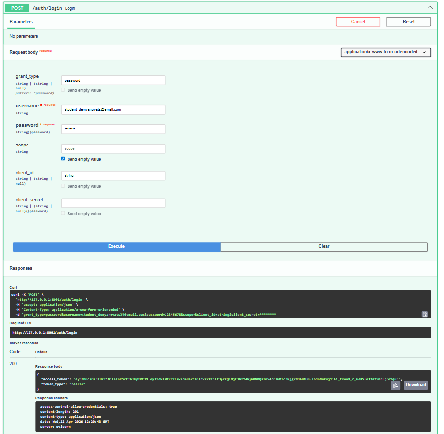
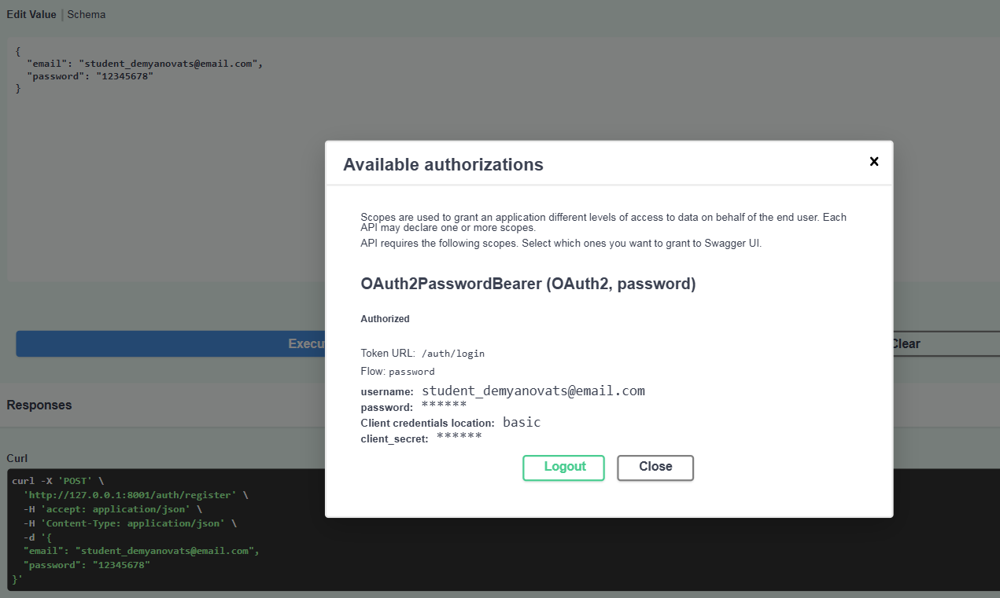
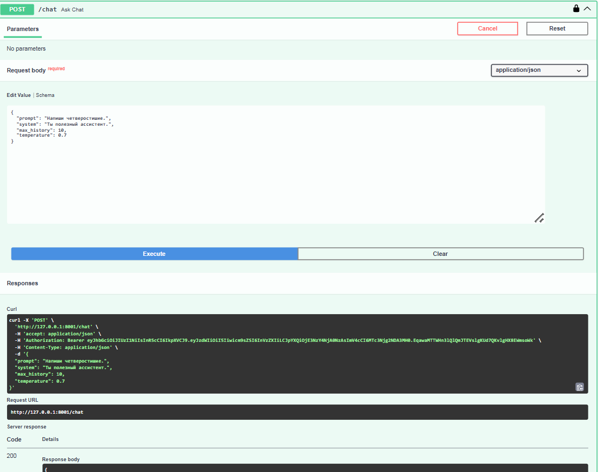
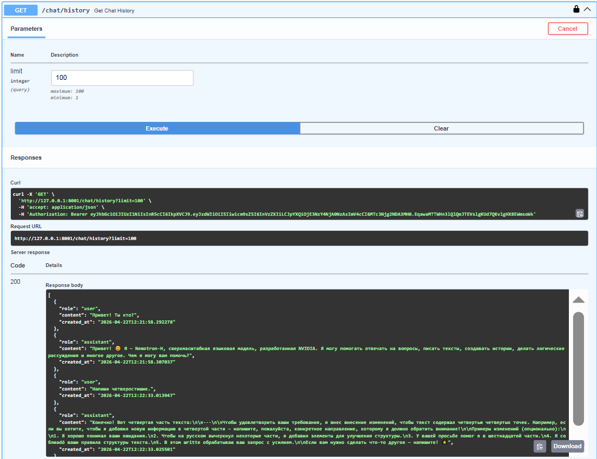
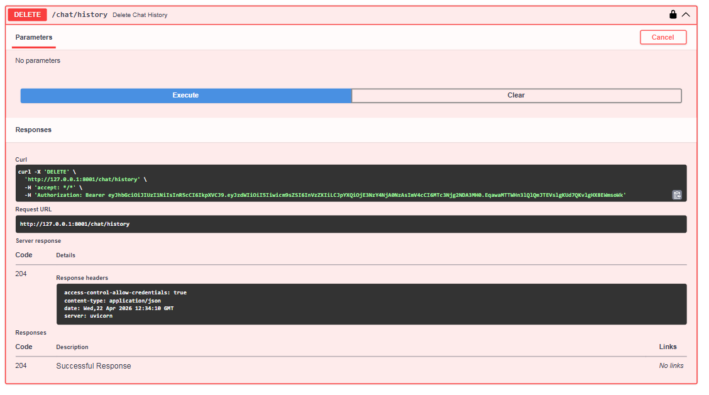
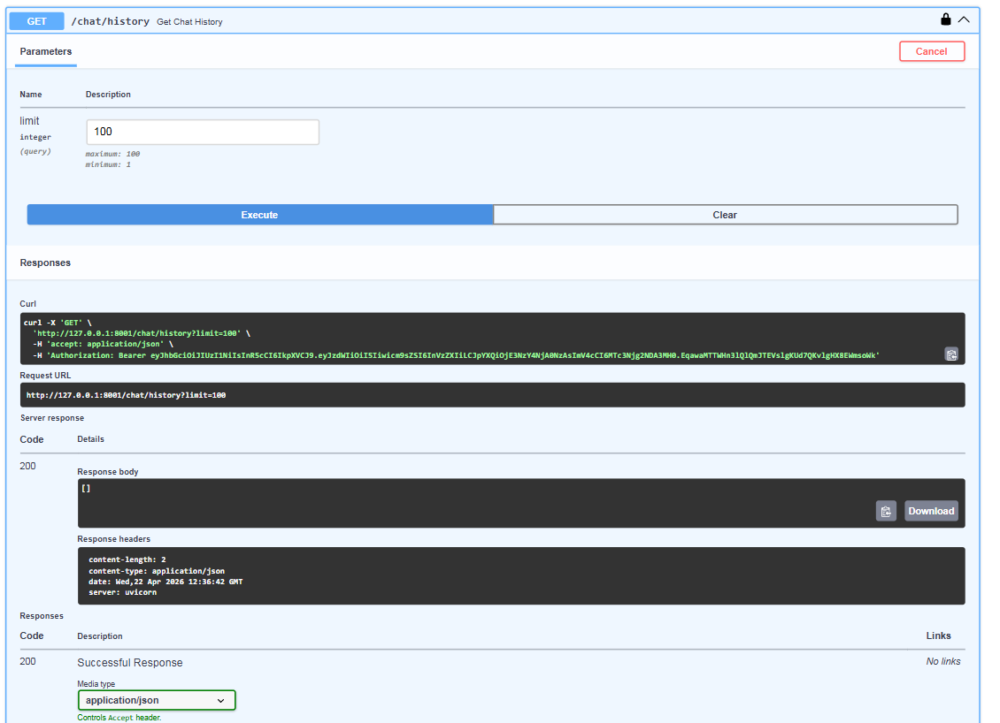

# llm-p

Защищённый backend API для работы с большой языковой моделью через **FastAPI** и **OpenRouter**.

## Описание проекта

Приложение реализует:

- регистрацию пользователя;
- аутентификацию и выдачу JWT access token;
- доступ к защищённым эндпоинтам через авторизацию в Swagger;
- отправку запросов к LLM через OpenRouter;
- сохранение истории диалога;
- получение и удаление истории сообщений.

## Стек технологий

- Python 3.12
- FastAPI
- Uvicorn
- Pydantic
- pydantic-settings
- SQLAlchemy
- SQLite
- Passlib / bcrypt
- JWT
- OpenRouter API
- uv

---

## Структура проекта

```text
app/
├── api/            # эндпоинты и dependency injection
├── core/           # конфигурация, безопасность, ошибки
├── db/             # база данных, модели, сессии
├── repositories/   # слой доступа к данным
├── schemas/        # Pydantic-схемы запросов и ответов
├── services/       # внешние сервисы, в т.ч. OpenRouter
├── usecases/       # бизнес-логика приложения
└── main.py         # точка входа FastAPI
```

---

## Конфигурация

Проект использует настройки из файла `.env`.

Создайте файл `.env` в корне проекта:

```env
APP_NAME=llm-p
ENVIRONMENT=dev

JWT_SECRET_KEY=change-me
JWT_ALGORITHM=HS256
JWT_ACCESS_TOKEN_EXPIRE_MINUTES=60

SQLITE_PATH=app.db

CORS_ENABLED=true
CORS_ALLOW_ORIGINS=["http://localhost:3000","http://127.0.0.1:3000"]

OPENROUTER_API_KEY=your_openrouter_api_key
OPENROUTER_BASE_URL=https://openrouter.ai/api/v1
OPENROUTER_MODEL=openrouter/free
OPENROUTER_REFERER=http://localhost:8000
OPENROUTER_TITLE=llm-p
```

---

## Установка и запуск проекта через uv

### 1. Клонирование репозитория

```bash
git clone https://github.com/Tatyana495/API.git
cd API
```

### 2. Создание виртуального окружения

```bash
uv venv
```

### 3. Активация виртуального окружения

**Windows PowerShell**

```powershell
.venv\Scripts\Activate.ps1
```

### 4. Установка зависимостей

Вариант, соответствующий требованиям задания:

```bash
uv pip compile pyproject.toml -o requirements.txt
uv pip install -r requirements.txt
```

Альтернативно можно использовать:

```bash
uv sync
```

### 5. Запуск приложения

```bash
uv run uvicorn app.main:app --reload --host 0.0.0.0 --port 8000
```

После запуска будут доступны:

- Swagger UI: `http://127.0.0.1:8000/docs`
- OpenAPI schema: `http://127.0.0.1:8000/openapi.json`

---

## Основные эндпоинты

### Аутентификация

#### `POST /auth/register`

Регистрация нового пользователя.

Пример тела запроса:

```json
{
  "email": "student_demyanov@email.com",
  "password": "12345678"
}
```

#### `POST /auth/login`

Вход в систему и получение JWT access token.

Используется `application/x-www-form-urlencoded`.

Поля формы:

- `grant_type=password`
- `username=student_demyanov@email.com`
- `password=12345678`

Пример ответа:

```json
{
  "access_token": "jwt_token_here",
  "token_type": "bearer"
}
```

#### `GET /auth/me`

Получение данных текущего пользователя.

Требует авторизацию.

---

### Чат

#### `POST /chat`

Отправка запроса к LLM через OpenRouter.

Требует авторизацию.

Пример тела запроса:

```json
{
  "prompt": "Привет! Ответь одной короткой фразой.",
  "system": "Ты полезный ассистент.",
  "max_history": 10,
  "temperature": 0.7
}
```

Пример ответа:

```json
{
  "answer": "Привет! Чем я могу тебе помочь?"
}
```

#### `GET /chat/history`

Получение истории диалога текущего пользователя.

Требует авторизацию.

#### `DELETE /chat/history`

Удаление истории диалога текущего пользователя.

Требует авторизацию.

---

## Проверка работы проекта через Swagger

После запуска открой:

```text
http://127.0.0.1:8000/docs
```

Порядок проверки:

1. Выполнить `POST /auth/register`
2. Выполнить `POST /auth/login`
3. Нажать кнопку **Authorize**
4. Выполнить `GET /auth/me`
5. Выполнить `POST /chat`
6. Выполнить `GET /chat/history`
7. Выполнить `DELETE /chat/history`

Для демонстрации на скриншотах используется email:

```text
student_demyanov@email.com
```

---

## Демонстрация работы эндпоинтов

> Все скриншоты должны быть размещены в папке `images` в корне проекта.

### 1. Регистрация пользователя `POST /auth/register`

Используемый email: `student_demyanov@email.com`



---

### 2. Логин и получение JWT `POST /auth/login`

На скриншоте должен быть виден `access_token`.



---

### 3. Авторизация через Swagger

На скриншоте должна быть видна успешная авторизация через кнопку **Authorize**.



---

### 4. Вызов `POST /chat`

На скриншоте должен быть виден успешный ответ модели.



---

### 5. Получение истории `GET /chat/history`

На скриншоте должна быть видна сохранённая история диалога.



---

### 6. Удаление истории `DELETE /chat/history`

На скриншоте должен быть виден код ответа `204 No Content`.



---

### 7. Проверка очистки истории `GET /chat/history`

На скриншоте должно быть видно, что история очищена.



---

## Примеры curl-запросов

### Регистрация

```bash
curl -X POST "http://127.0.0.1:8000/auth/register" \
  -H "Content-Type: application/json" \
  -d "{\"email\":\"student_demyanov@email.com\",\"password\":\"12345678\"}"
```

### Логин

```bash
curl -X POST "http://127.0.0.1:8000/auth/login" \
  -H "Content-Type: application/x-www-form-urlencoded" \
  -d "grant_type=password&username=student_demyanov@email.com&password=12345678"
```

### Вызов чата

```bash
curl -X POST "http://127.0.0.1:8000/chat" \
  -H "Authorization: Bearer <your_jwt_token>" \
  -H "Content-Type: application/json" \
  -d "{\"prompt\":\"Привет! Ответь одной короткой фразой.\",\"system\":\"Ты полезный ассистент.\",\"max_history\":10,\"temperature\":0.7}"
```

### Получение истории

```bash
curl -X GET "http://127.0.0.1:8000/chat/history" \
  -H "Authorization: Bearer <your_jwt_token>"
```

### Удаление истории

```bash
curl -X DELETE "http://127.0.0.1:8000/chat/history" \
  -H "Authorization: Bearer <your_jwt_token>"
```

---

## Проверка качества кода

После завершения разработки проект был проверен с помощью линтера **Ruff**.

Команды для проверки:

```bash
uv run ruff check .
uv run ruff format --check .
```

Для автоматического исправления форматирования:

```bash
uv run ruff format .
```

---

## Возможные ошибки

### `401 Unauthorized`

Токен отсутствует, недействителен или истёк.

### `409 Conflict`

Пользователь с таким email уже существует.

### `422 Validation Error`

Некорректный формат входных данных.

### `502 Bad Gateway`

Ошибка при обращении к OpenRouter.

Возможные причины:

- не задан `OPENROUTER_API_KEY`;
- неверный API-ключ;
- недоступна выбранная модель;
- ошибка сети при обращении к OpenRouter.

---

## Результат

Проект демонстрирует:

- корректную структуру FastAPI-приложения;
- разделение на слои `api / usecases / repositories / services`;
- JWT-аутентификацию и авторизацию;
- работу с внешним LLM API через OpenRouter;
- сохранение истории запросов пользователя;
- тестирование эндпоинтов через Swagger UI.
